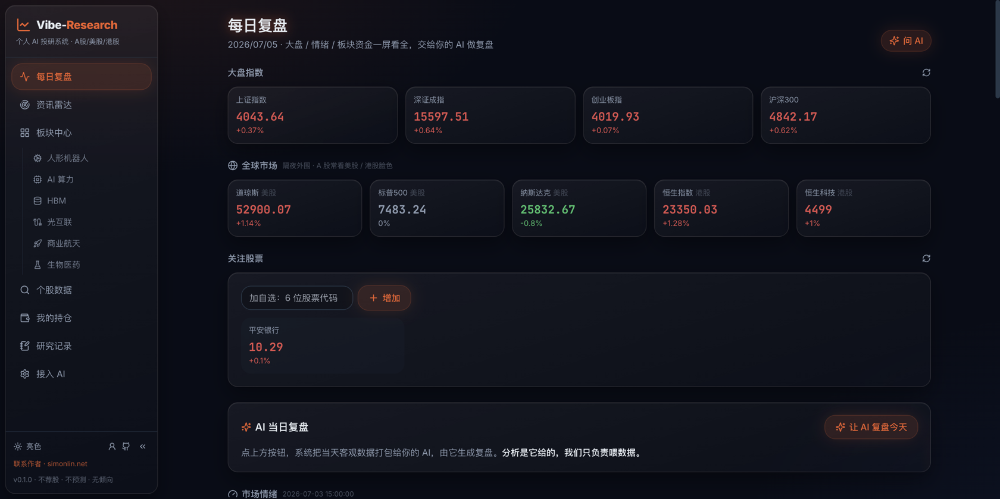
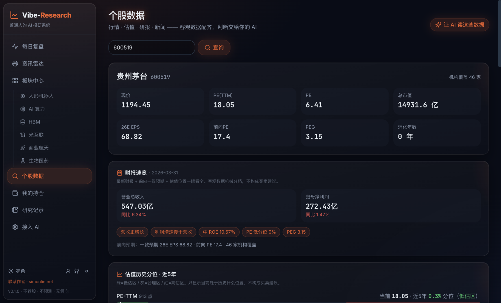
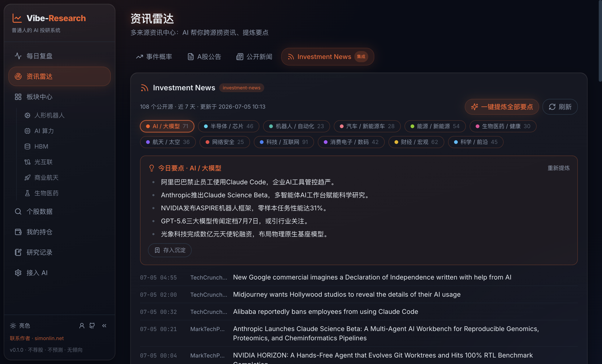

# Vibe-Research · 个人 AI 量化投研与选股系统

[](https://www.python.org/)
[](https://react.dev/)
[](https://fastapi.tiangolo.com/)
[](LICENSE)

Vibe-Research 是一个面向 A 股（兼顾美股、港股）的个人量化投研与选股看板系统。系统以**动量主线（RPS）**与**机构持仓**为核心，深度集成**自研通达信公式引擎**与 **3L 交易体系风控择时**，并提供开放的 AI 分析接口，协助交易者完成从复盘、选股、择时到风控的全流程闭环。

---

## 🖥️ 产品界面预览



<table>
<tr>
<td width="50%">

**个股数据分析**



</td>
<td width="50%">

**全球资讯雷达**



</td>
</tr>
</table>

---

## 🌟 系统核心功能

### 1. 🎯 量化选股与通达信公式引擎
- **两阶段量化流水线**：
  - **阶段一（机构基础池）**：自动获取公募基金持仓数据（基金占流通股 ≥ X%）与港交所官方北向持股（市值 ≥ Y 亿），通过并集锁定全市场 500~1000+ 只机构重仓主力样本。
  - **阶段二（技术公式过滤）**：通过自研通达信公式解释器对基础池进行严苛的技术形态与动量二次筛选。
- **自研通达信公式 AST 解释器**：
  - 自带词法（Lexer）、语法（Parser）和时间序列求值器，不依赖 `eval`/`exec`，安全稳定。
  - 支持常用通达信函数：`MA`、`HHV`、`LLV`、`REF`、`COUNT`、`EVERY`、`HHVBARS`、`LLVBARS`、`BARSSINCEN`、`IF`、`CODELIKE` 等。
  - 深度支持特色函数：`EXTDATA_USER`（读取全市场归一化 RPS20/50/120/250）与 `FINANCE(43/44)`（净利润/营收同比增速）。
  - 内置经典策略（接近一年新高、月线反转 6.2、RPS 高成长 MRGC/SXHCG、蓝钻低吸等），并支持自定义通达信公式的新建与保存。
- **全市场 RPS 动量引擎**：
  - 沪深全市场 5100+ 只股票统一样本，自动剔除不足 251 根日 K 的次新股，基于精确前复权收盘价计算 0~1000 归一化排序。
  - 后台自动定时预热（每日 9:00 / 15:30 / 16:30），结果快照持久化。
- **日 K 本地持久化极速缓存**：
  - 内置 SQLite WAL + 内存双层缓存机制，全市场 RPS 预热数据自动反哺日 K 库。
  - 选股日 K 读取达微秒级，选股结果 72 小时本地双重持久化，杜绝页面休眠或刷新丢失数据。

### 2. 📈 策略历史回测与胜率统计
- **历史选股回放（Point-in-Time Screening）**：
  - 支持一键切换【今日实时选股】与【历史回测模式】，提供自由日期选择器与快捷回测入口（1周前/1月前/3月前/半年前/1年前）。
  - 数据严格基于历史节点切片，杜绝未来函数。
- **未来收益追踪与胜率矩阵**：
  - 全自动追踪被选个股在随后的 **T+5、T+10、T+20、T+60 交易日真实收盘收益率**。
  - 统计 **20 日内最大浮盈**与 **20 日内最大回撤**。
  - 汇总生成策略绩效看板：展示各周期胜率（>0% 占比）、平均涨幅、盈亏比（平均盈利/平均亏损）及涨跌中位数。

### 3. 🛡️ 3L 交易体系风控与量价择时
（深度融合《3L交易体系：动量主线/最强逻辑/量价择时/风险控制》实战原则）
- **量价择时与生命线指标**：
  - **生命线 MA20**：自动计算 20 日均线价格及均线趋势斜率（▲向上多头 / ▼向下走弱 / —走平）。
  - **3L 择时状态评估**：自动判定形态阶段（均线低吸点、关键点突破、主升通道、乖离过大超买、破位回避）。
- **风控防线与盈亏比**：
  - **硬止损点（-8%）**：自动计算硬止损价格，严格防范单票大亏。
  - **结构关键支撑**：自动计算 `LLV(L, 20)` 近 20 日最低价支撑位。
  - **预估盈亏比核算**：核算潜在获利空间与止损空间比值，智能识别 ≥ 3:1 优质机会。
  - **风险标签预警**：自动提示破20日线、超买乖离、动量弱化（RPS<85）、高换手分歧。
- **买前十问知行合一检查表**：
  - 提供交互式复核弹窗，包含大盘环境、动量主线、新高印证、最强逻辑、关键点形态、生命线乖离、止损预案、盈亏比、回避模板、仓位纪律 10 项标准核对，实时计算知行合一评分。

### 4. 📊 市场全景与每日复盘
- **市场情绪全景**：大盘涨跌家数比、涨跌停分布、连板股统计、最高连板梯队、封板率与炸板率。
- **成交与资金追踪**：全市场成交额 TOP20、北向资金分时流向、行业与概念板块主力净流入榜。
- **全球市场联动**：隔夜美股（道指/标普/纳指）与港股（恒指/恒生科技）行情同屏呈现。
- **低调模式**：支持一键切换界面配色与数据脱敏，适合办公环境查看。

### 5. 🚀 板块强度与动量分析
- **通达信板块联动**：支持读取本地通达信 `blocknew` 板块数据（`.blk` / `.cfg`）。
- **板块 RPS 动量跟踪**：支持对申万行业、通达信板块及自定义板块计算 RPS5 / RPS10 / RPS15 / RPS20，一眼看清当前主线动量板块。

### 6. 🔍 个股深度投研
- **多市场行情**：覆盖 A 股、美股、港股行情与带精确前复权的历史日 K、周 K、60 分钟线。
- **基本面与资金面**：财报速览（营收/净利同比）、估值历史分位、前向 PE/PEG、主力资金流向、融资融券、股东户数、龙虎榜与大宗交易。

### 7. 📡 资讯雷达与研报管理
- **资讯雷达**：覆盖 12 个重点赛道、108 个公开 RSS 资讯源，支持关键词检索与要点提取。
- **本地研报库**：支持拖拽上传 PDF/Word 研报，自动按文件名分行业归档，纯本地存储，安全隐私。

### 8. 💼 持仓与自选股管理
- **持仓收益跟踪**：支持记录持仓成本、现价联动、浮动盈亏计算与已平仓记录。
- **自选股**：支持批量粘贴代码一键添加，自选列表及备注纯保存在浏览器本地，不上传服务器。

### 9. 🤖 开放式 AI 投研接入
- **本机 CLI 模式（免 Key）**：支持直接调起本机已安装的 Claude Code、Codex、Qwen、DeepSeek CLI 运行分析。
- **API 模式**：兼容 OpenAI 协议及各类兼容端点，支持多轮 Function Calling 自动调取行情、估值、研报与新闻数据。
- **MCP 服务**：支持挂载为标准 MCP Server，供外部 Agent 工具调用。

---

## 🚀 快速开始

### 依赖环境
- **Python**: 3.10 及以上
- **Node.js**: 18 及以上

### 1. 启动后端（端口 8900）
```bash
cd backend
python -m venv .venv

# Windows
.venv\Scripts\pip install -r requirements.txt
.venv\Scripts\python -m uvicorn app:app --host 127.0.0.1 --port 8900

# macOS / Linux
.venv/bin/pip install -r requirements.txt
.venv/bin/python -m uvicorn app:app --host 127.0.0.1 --port 8900
```

### 2. 启动前端（端口 5899）
```bash
cd frontend
npm install
npm run dev
```

启动完成后，在浏览器打开：**`http://localhost:5899`**

---

## 🏗️ 系统架构

```
Vibe-Research/
├── backend/                  # 后端服务（FastAPI）
│   ├── app.py                # HTTP / 流式 SSE 路由接口
│   ├── quant.py              # 量化选股引擎、全市场 RPS 与回测计算
│   ├── bars_cache.py         # 日 K 本地持久化缓存（SQLite WAL + 内存）
│   ├── tdx_formula.py        # 自研通达信公式词法/语法/求值解释器
│   ├── tdx_presets.py        # 预设通达信选股策略
│   ├── astock.py             # A 股行情与数据层（腾讯 / 东方财富 / mootdx）
│   ├── gstock.py             # 美股 / 港股行情数据
│   ├── market.py             # 市场情绪、板块资金流与全球指数
│   ├── newsradar.py          # 全球资讯雷达
│   ├── portfolio.py          # 持仓管理
│   ├── chat.py               # AI 对话与函数调用循环
│   └── cli_runtime.py        # 本地 CLI 子进程调度
└── frontend/                 # 前端看板（React 19 + TypeScript + TailwindCSS）
    ├── src/pages/            # 核心路由页面
    │   ├── QuantScreening.tsx# 量化选股、回测与 3L 风控页面
    │   ├── DailyReview.tsx   # 每日复盘与市场全景
    │   ├── SectorStrength.tsx# 板块强度与动量分析
    │   ├── StockData.tsx     # 个股深度投研
    │   ├── Watchlist.tsx     # 自选股列表
    │   ├── Portfolio.tsx     # 我的持仓
    │   └── Intel.tsx         # 资讯雷达
    └── src/lib/              # 客户端 API 与工具函数
```

---

## ⚠️ 免责声明

本项目仅供量化策略研究与学习交流，**不构成任何投资建议或买卖依据**。系统仅提供客观数据整理、公式计算与图表呈现，不预测涨跌、不承诺收益。股市有风险，入市需谨慎。

---

## 📄 开源协议

本项目采用 [MIT License](LICENSE) 协议开源。
